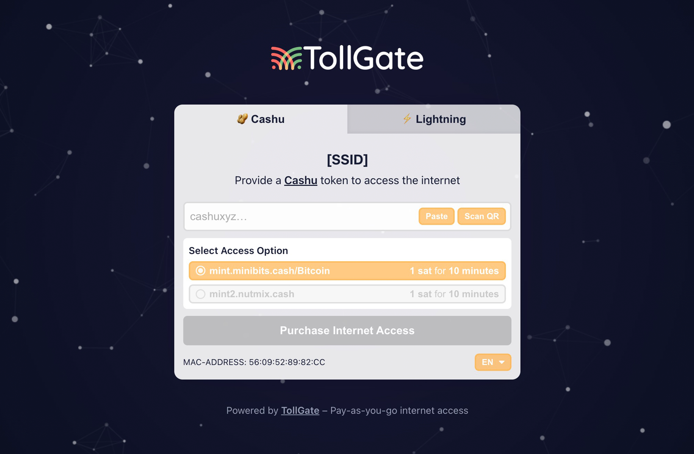

# Tollgate Captive Portal



A captive portal website for [Tollgate](https://tollgate.me) with a light moving background. This portal allows users to paste a Cashu token or pay with BTC Lightning to gain internet access.

## Features

- Pay with Cashu Token
- Pay with BTC Lightning

## Getting Started

### Prerequisites

- Node.js (v22.17.0 or later)
- npm (v10.9.2 or later)

### Installation

1. Clone the repository
```bash
git clone <repository-url>
cd tollgate-captive-portal-site
```

2. Install dependencies
```bash
npm install
```

3. Start the development server (Vite)
```bash
npm run dev
```

The application will be available at http://localhost:5173 (or the port shown in your terminal).

### Production Build

To create a production build:

```bash
npm run build
```

To preview the production build locally:

```bash
npm run preview
```

The build files will be generated in the `dist` directory.

#### Rename Output HTML (Optional)

To rename the output `index.html` to `splash.html` in the `dist` directory (for captive portal compatibility):

```bash
npm run rename-html
```

## How It Works

1. The user is presented with a captive portal screen when they try to access the internet
2. The user pastes their Cashu token into the input field
3. The token value is displayed to the user
4. The user clicks the "Send Token" button
5. The token is sent to a Nostr relay at 192.168.1.1:3334 as a kind 21000 event
6. If successful, the user is granted internet access

## Configuration

To configure the Nostr relay address and other settings, modify the relevant variables in the [`tollgate.js`](./src/helpers/tollgate.js) file.

## Internationalization (i18n)

This project uses [i18next](https://www.i18next.com/) and [react-i18next](https://react.i18next.com/) for internationalization support.

- **Supported languages** are managed in [`src/helpers/i18n.js`](./src/helpers/i18n.js) via the `supportedLanguages` array.
- **Translation files** are located in the [`public/locales/`](./public/locales/) directory. Each language has its own JSON file (e.g., `en.json`).
- **Language detection** is automatic, using the browser's language settings. The default fallback language is English (`en`).
- **Adding a new language:**
  1. Add the language code (e.g., `de` for German) to the `supportedLanguages` array in `i18n.js`.
  2. Create a new translation file in `public/locales/` (e.g., `de.json`) following the structure of `en.json`.

## Error Codes

#### Tollgate Error Codes 

[`src/helpers/tollgate.js`](src/helpers/tollgate.js)

| Code   | Label                              | Meaning                                                                 |
|--------|------------------------------------|-------------------------------------------------------------------------|
| `TG01` | Failed to fetch TollGate details   | The request to fetch TollGate details failed (non-OK HTTP response).    |
| `TG02` | Failed to fetch device info        | The request to fetch device info (MAC address) failed (non-OK HTTP response). |
| `TG03` | Could not fetch TollGate information | TollGate could not connect to its relay. Contact the network administrator or try again later. |
| `TG04` | Pricing Error                      | Could not get TollGate pricing information.                             |

#### Cashu Error Codes

[`src/helpers/cashu.js`](src/helpers/cashu.js)

| Code   | Label                  | Meaning                                              |
|--------|------------------------|------------------------------------------------------|
| `CU01` | No access options available | Could not parse TollGate access options.             |
| `CU02` | Token missing          | No token was provided.                               |
| `CU03` | Invalid token format   | The provided token does not start with "cashu".      |
| `CU04` | Invalid Cashu Token    | The token could not be decoded.                      |
| `CU05` | Token proofs missing   | Token was successfully decoded but no proofs were found. |
| `CU06` | Token validation error | An error occurred during token validation/decoding.   |
| `CU07` | Payment failed         | Failed to generate keys to sign the payment event.    |
| `CU08` | Payment failed         | Your token was not accepted (HTTP 402).              |
| `CU09` | Payment failed         | Server error. Reload the page and try again.          |
| `CU10` | Payment failed         | Error sending token. Reload the page and try again.   |
| `CU11` | Not enough funds         | This token does not provide enough funds for the selected Mint.   |

## License

This project is licensed under the GPLv3 License.
