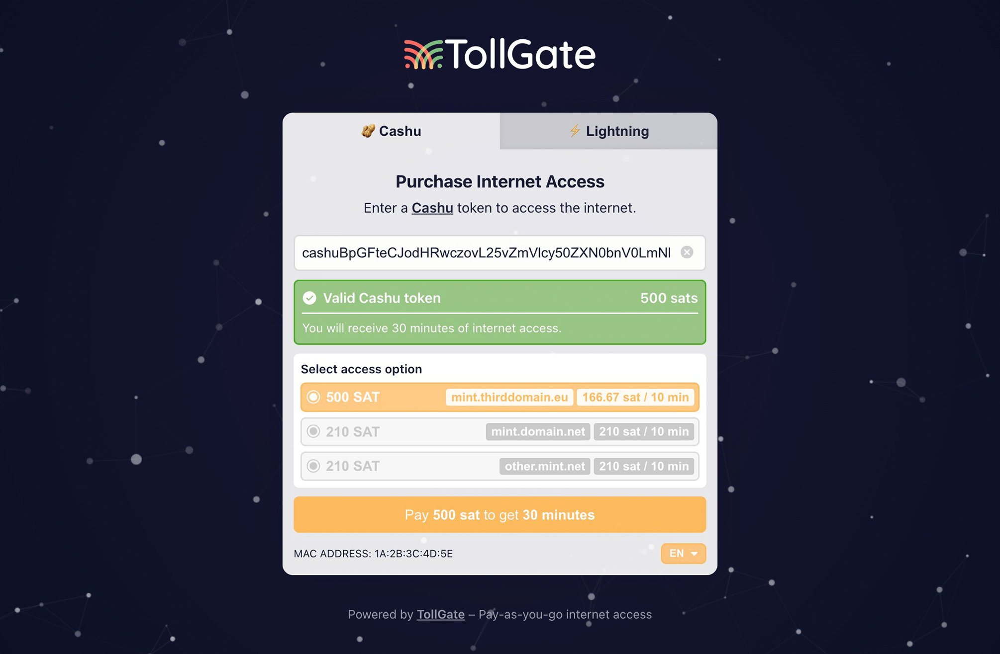

# Tollgate Captive Portal



A captive portal website for [Tollgate](https://tollgate.me). This portal allows users to paste a Cashu token or pay with BTC Lightning to gain internet access.

## Features

- Pay with Cashu Token
- Pay with BTC Lightning

## Contributing

### Internationalization (i18n)

Add a new `[language_code]` to the `supportedLanguages` array in [`./src/helpers/i18n.js`](./src/helpers/i18n.js)

Create `[language_code].json` file in [`./public/locales/`](./public/locales/) folder and follow the structure of [`./public/locales/en.json`](./public/locales/en.json).

---

### Development

- Node.js (v22.17.0 or later)
- npm (v10.9.2 or later)

#### Installation

1. Clone the repository
```bash
git clone <repository-url>
cd tollgate-captive-portal-site
```

2. Install dependencies
```bash
npm install
```

3. Start the development server
```bash
npm run dev
```

#### Configuration

To configure the Nostr relay address and other settings, modify the relevant variables in the [`tollgate.js`](./src/helpers/tollgate.js) file.

The hardcoded mock data (used for development) should be updated regularly to match the latest [TollGate protocol tip01 example](https://github.com/OpenTollGate/tollgate/blob/main/protocol/01.md). This ensures development and testing reflect the current protocol.

---

### Error Codes

#### TollGate Error Codes

| Code   | Use-Case Description |
|--------|---------------------|
| `TG001` | Triggered when the app fails to fetch TollGate details from the backend (e.g., network/server error on the main details endpoint). |
| `TG002` | Triggered when the app fails to fetch device information (such as MAC address) from the backend. |
| `TG003` | Triggered when there is a general error fetching TollGate data, such as a network failure or the relay is unreachable. |
| `TG004` | Triggered when the app cannot extract or parse pricing information from the TollGate details event (e.g., missing or malformed pricing tags). |

#### Cashu Error Codes

| Code   | Use-Case Description |
|--------|---------------------|
| `CU001` | Triggered when no valid access options are available for the user (e.g., no valid mints or pricing options found in the TollGate event). |
| `CU002` | Triggered when the provided Cashu token does not contain enough funds for the selected mint or access option. |
| `CU100` | Triggered when the user submits an empty or missing token. |
| `CU101` | Triggered when the provided token does not start with "cashu" (invalid format). |
| `CU102` | Triggered when the token cannot be decoded (malformed or corrupted token). |
| `CU103` | Triggered when the token is decoded but contains no proofs (i.e., no spendable value). |
| `CU104` | Triggered when there is a general error during token validation or decoding (unexpected error). |
| `CU105` | Triggered when the app fails to generate cryptographic keys needed to sign the payment event (client-side cryptography error). |
| `CU106` | Triggered when the backend (TollGate) rejects the token with a 402 (payment required) response, meaning the token was not accepted. |
| `CU107` | Triggered when the backend returns a general server error (not 402) during token submission. |
| `CU108` | Triggered when there is a client-side error sending the token to the backend (e.g., network failure or unexpected error during submission). |

#### Lightning Error Codes

| Code   | Use-Case Description |
|--------|---------------------|
| `LN001` | Triggered when no valid access options are available for Lightning payments (e.g., no valid mints or pricing options found). |
| `LN002` | Triggered when the user-specified amount is not enough to purchase access from the selected mint. |

#### Clipboard Error Codes

| Code   | Use-Case Description |
|--------|---------------------|
| `CB001` | Triggered when the browser denies permission to read from the clipboard (user did not grant access). |
| `CB002` | Triggered when reading from the clipboard fails for any other reason (e.g., clipboard is empty, or an unexpected error occurs). |

#### QR Code Error Codes

| Code   | Use-Case Description |
|--------|---------------------|
| `QR001` | Triggered when the browser denies permission to access the camera for QR scanning. |
| `QR002` | Triggered when the app fails to read a QR code from the camera (e.g., camera error, no QR code detected, or scan interrupted). |
| `QR003` | Triggered when the user uploads an image but no QR code is found in the selected image. |
| `QR004` | Triggered when there is a general camera error (e.g., no camera present, or the page does not have permission to use it). |

---

### Discussion Topics

- [ ] **Handle exotic units in access options sorting**  
  The code currently sorts access options by price per step, assuming all units are directly comparable (e.g., all in 'sat'). If a new or exotic unit appears (not 'sat'), the comparison may be invalid. Logic should be added to handle and compare different units safely.

- [ ] **Check if token unit matches mint unit**  
  When validating a Cashu token, the code should verify that the unit of the token matches the unit expected by the selected mint (e.g., both are 'sat'). If they do not match, the user should be shown an appropriate error.

- [ ] **Status and open questions for Lightning implementation**  
  The Lightning payment flow currently uses a placeholder invoice is not fully integrated. What are the next steps for a production-ready Lightning integration?

- [ ] **Captive portals may restrict camera or clipboard permissions**  
  Captive portals often run in restricted network environments, which may prevent browsers from granting camera or clipboard permissions—even if the portal is served over HTTPS. How should the app handle or communicate these limitations to users, and what are possible workarounds or fallback strategies?

### License

This project is licensed under the GPLv3 License.

