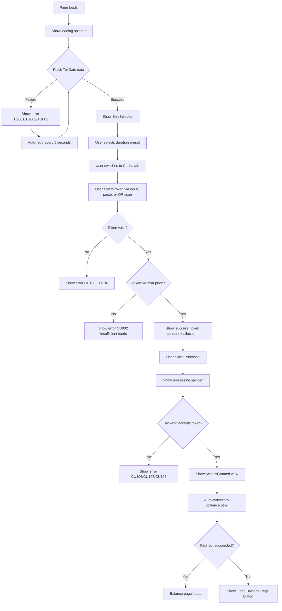
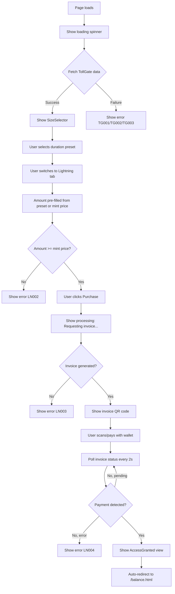
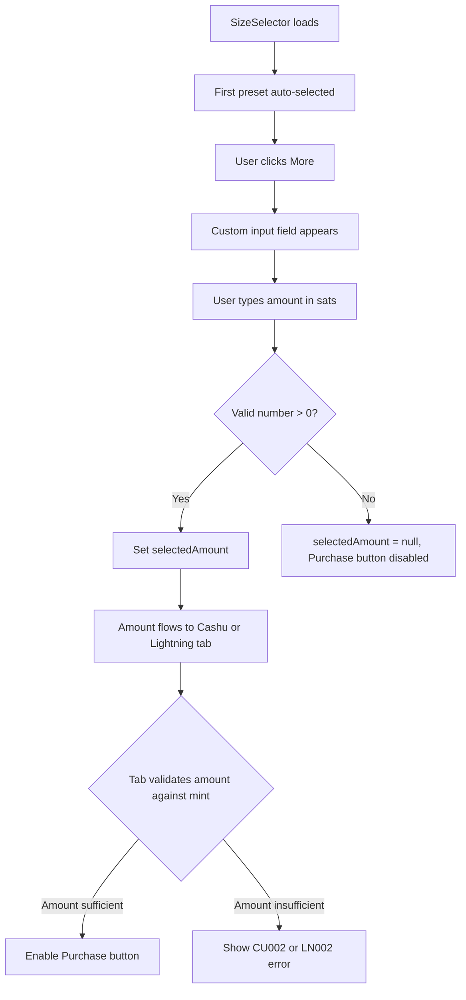
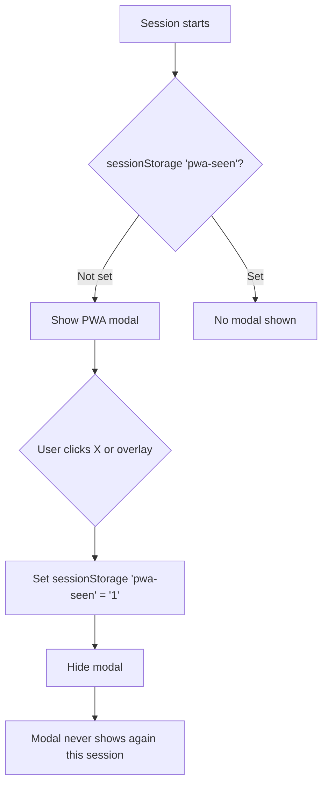
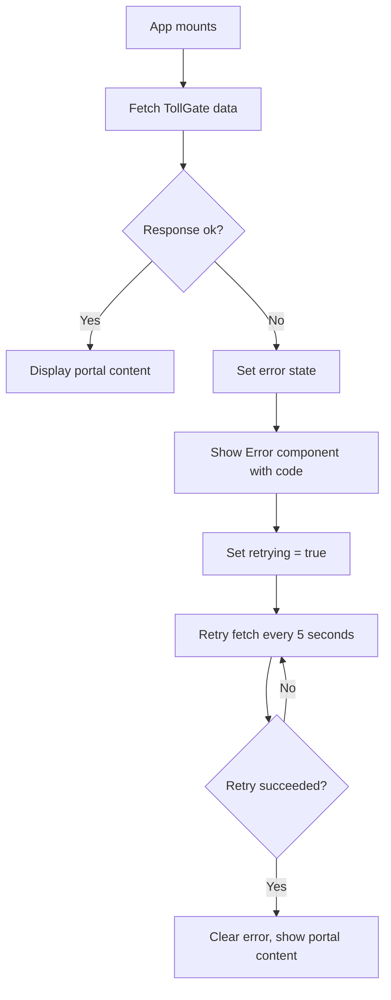
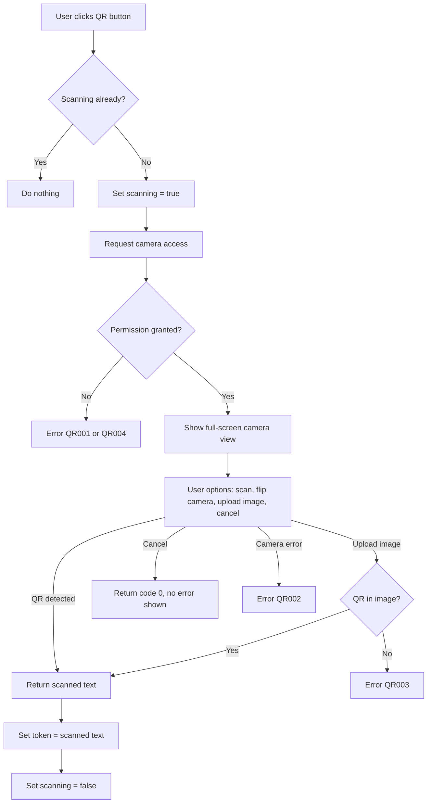

# TollGate Captive Portal - User Stories & Flows

## Table of Contents

1. [Epics & User Stories](#1-epics--user-stories)
2. [User Flows](#2-user-flows)
3. [UI States](#3-ui-states)
4. [Error Codes](#4-error-codes)
5. [Mock Mode](#5-mock-mode)
6. [Theme System](#6-theme-system)
7. [Internationalization](#7-internationalization)
8. [Components](#8-components)

---

## 1. Epics & User Stories

### Epic 1: Pay for Internet Access with Cashu

> As a user on a TollGate network, I want to pay with a Cashu token so I can get online.

#### Story 1.1: Enter Cashu Token via Text Input

**As a** user  
**I want to** type or paste a Cashu token into the input field  
**So that** I can pay for internet access

**Acceptance Criteria:**
- Input field is visible on the Cashu tab with placeholder "cashuxyz..."
- Typing a valid token triggers real-time validation
- Valid tokens show a green success status with amount and allocation
- Invalid tokens show a red error status with a specific error code
- A clear (X) button appears when text is present in the input
- Without text, "Paste" and "QR" action buttons are shown instead

#### Story 1.2: Paste Cashu Token from Clipboard

**As a** user  
**I want to** paste a Cashu token from my clipboard  
**So that** I don't have to type it manually

**Acceptance Criteria:**
- "Paste" button requests clipboard read permission from the browser
- On success, the token text populates the input field and triggers validation
- On permission denied (CB001), an error message appears
- On other clipboard failures (CB002), an error message appears
- Captive portal environments may block clipboard access; fallback is manual typing

#### Story 1.3: Scan Cashu Token via QR Code

**As a** user  
**I want to** scan a QR code containing a Cashu token  
**So that** I can pay without typing

**Acceptance Criteria:**
- "QR" button opens a full-screen camera view with a cancel button
- Camera flip button appears if multiple cameras are detected
- Upload from file button allows scanning a QR from an image
- Successful scan populates the input field with the token text
- Camera permission denial (QR001) shows an error
- Scan failure (QR002) shows an error
- No QR found in uploaded image (QR003) shows an error
- General camera error (QR004) shows an error in the overlay
- User cancellation returns silently (code 0, no error shown)
- Captive portal environments may block camera access; fallback is paste or type

#### Story 1.4: Select Access Option (Mint)

**As a** user  
**I want to** choose which mint/access option to pay with  
**So that** I can pick the best price for my needs

**Acceptance Criteria:**
- Available mints are listed as buttons under "Select access option"
- Each button shows: price + unit, mint address (stripped of https://), and price-per-step breakdown
- The first (cheapest) mint is auto-selected on load
- Clicking a mint highlights it with the CTA color
- Switching mints recalculates the allocation and re-validates the token

#### Story 1.5: Purchase Access with Cashu Token

**As a** user  
**I want to** submit my Cashu token for payment  
**So that** I gain internet access

**Acceptance Criteria:**
- "Purchase" button is disabled when no valid token is entered or an error is present
- Button text changes to "Pay {amount} {unit} to get {allocation}" when a valid token is present
- Clicking the button triggers the processing state (spinner + "Processing payment...")
- On success, the AccessGranted view appears with allocation details
- On backend rejection (CU106, CU107, CU108), an error is displayed
- On key generation failure (CU105), an error is displayed
- After success, the user is auto-redirected to /balance.html within 0.9 seconds
- If redirect fails, a fallback "Open Balance Page" link appears after 2.5 seconds

---

### Epic 2: Pay for Internet Access with Lightning

> As a user on a TollGate network, I want to pay with BTC Lightning so I can get online.

#### Story 2.1: Specify Payment Amount

**As a** user  
**I want to** enter the amount of sats to pay  
**So that** I can control how much access I buy

**Acceptance Criteria:**
- Input field accepts numeric values only (inputMode="numeric")
- Plus/minus buttons adjust the amount by the mint's minimum price
- Minus button is disabled when reducing would go below the minimum price
- Changing the amount triggers real-time validation against the selected mint
- Amount below the mint price triggers LN002 error
- When a SizeSelector preset is active, the amount is pre-filled from the preset

#### Story 2.2: Generate Lightning Invoice

**As a** user  
**I want to** generate a Lightning invoice for my chosen amount  
**So that** I can pay with my Lightning wallet

**Acceptance Criteria:**
- "Purchase" button is disabled when no amount is entered or an error is present
- Button text shows "Pay {amount} {unit} to get {allocation}" when valid
- Clicking triggers processing state (spinner + "Requesting invoice...")
- Invoice is generated via POST /ln-invoice with amount and mint_url
- On failure (LN003), an error is shown
- On success, the invoice view replaces the input view

#### Story 2.3: Pay Lightning Invoice

**As a** user  
**I want to** see and pay the Lightning invoice  
**So that** my payment is processed

**Acceptance Criteria:**
- Invoice view shows a QR code of the invoice string
- "Open Wallet" link opens the invoice with a `lightning:` URI scheme
- "Copy" button copies the invoice text to the clipboard
- Invoice status is polled every 2 seconds via GET /ln-invoice?quote={quote}
- On payment detection, the AccessGranted view appears
- On poll failure (LN004), an error is shown
- Cancel button dismisses the invoice view and returns to the input view

#### Story 2.4: Select Access Option (Mint) for Lightning

**As a** user  
**I want to** choose which mint to use for Lightning payment  
**So that** I pick the right pricing option

**Acceptance Criteria:**
- Same mint selection UI as Cashu (radio buttons with price breakdown)
- Changing mint recalculates the amount and allocation
- Mint list hidden while an invoice is displayed

---

### Epic 3: Choose Access Duration (SizeSelector)

> As a user, I want to select how much internet access to buy so I only pay for what I need.

#### Story 3.1: Select a Time Preset

**As a** user  
**I want to** click a preset button for 15 min, 1 hour, or 10 hours  
**So that** I can quickly choose a common access duration

**Acceptance Criteria:**
- Three preset pills appear: "15 min", "1 hour", "10 hours"
- First preset is auto-selected on load
- Clicking a preset highlights it and sets the purchase amount
- Amount is calculated as: preset steps * mint price per step
- Preset steps are derived from step_size: 15min = ceil(900000/step_size), 1h = ceil(3600000/step_size), 10h = ceil(36000000/step_size)

#### Story 3.2: Enter Custom Amount

**As a** user  
**I want to** enter a custom amount of sats to spend  
**So that** I can buy exactly the access I need

**Acceptance Criteria:**
- "More" pill opens a custom input field (type="number", min="1")
- Custom input shows "sats" suffix label
- Only the "More" pill is highlighted when custom input is active
- Entering a valid positive number sets the purchase amount
- Entering zero, negative, or non-numeric text clears the selection (setSelectedAmount=null)
- Clicking a preset while in custom mode exits custom mode and restores the preset

#### Story 3.3: Select a Data Preset

**As a** user  
**I want to** click a preset for 100 MB, 1 GB, or 10 GB  
**So that** I can buy data-based access when the network bills by volume

**Acceptance Criteria:**
- When the TollGate metric is "bytes", presets switch to: "100 MB", "1 GB", "10 GB"
- Steps are derived from step_size: 100MB = ceil(104857600/step_size), 1GB = ceil(1073741824/step_size), 10GB = ceil(10737418240/step_size)
- Same selection and custom input behavior as time presets

---

### Epic 4: Understand My Connection Status

> As a user, I want to see my device info and balance so I know what's going on.

#### Story 4.1: View Device Information

**As a** user  
**I want to** see my device identifier (MAC address)  
**So that** I know which device is being authenticated

**Acceptance Criteria:**
- Device info is shown in the method footer (below the payment form)
- Displays format: "{type}: {value}" (e.g. "MAC Address: 1A:2B:3C:4D:5E")
- Device info is fetched from the TollGate backend at /whoami
- If device info is unavailable, "unknown_type: unknown_value" is shown

#### Story 4.2: View Balance Page

**As a** user  
**I want to** see my remaining internet balance  
**So that** I know when my access expires

**Acceptance Criteria:**
- After successful payment, user is auto-redirected to /balance.html within 0.9s
- Balance page shows: remaining, used, total purchased, billing metric
- Page auto-refreshes while the session is active
- "Refresh Balance" button allows manual refresh
- "Return to Portal" link navigates back
- Balance errors show BG001 or BG002 codes

---

### Epic 5: Install as PWA

> As a user, I want to add the portal to my home screen for quick future access.

#### Story 5.1: View PWA Install Prompt

**As a** user  
**I want to** see instructions for adding the portal to my home screen  
**So that** I can access it easily next time

**Acceptance Criteria:**
- PWA modal appears once per browser session (controlled by sessionStorage key 'pwa-seen')
- Modal shows: brand icon, "Add to Home Screen" title, install instructions (2 steps)
- Step 1: "Tap the share button below" (with share icon)
- Step 2: "Scroll down and tap 'Add to Home Screen'" (with plus icon)
- Close (X) button in top-right dismisses the modal
- Clicking the overlay background also dismisses the modal
- After dismissal, modal does not reappear until the session ends
- Feature can be disabled via theme.config.js: features.pwaModal = false

---

### Epic 6: Switch Language

> As a user, I want to use the portal in my preferred language.

#### Story 6.1: Change UI Language

**As a** user  
**I want to** switch the portal language  
**So that** I can understand the interface

**Acceptance Criteria:**
- Language dropdown appears in the method footer (next to device info)
- Lists all languages defined in supportedLanguages (currently only "en")
- Selecting a language immediately updates all translatable text
- Language choice persists via i18next-browser-languagedetector
- Fallback language is English

---

## 2. User Flows

### Flow 1: Cashu Payment (Happy Path)



### Flow 2: Lightning Payment (Happy Path)



### Flow 3: SizeSelector with Custom Amount



### Flow 4: PWA Modal Lifecycle



### Flow 5: Error Recovery (TollGate Data Fetch)



### Flow 6: QR Code Scanning



---

## 3. UI States

### 3.1 Global App States

| State | Description | Visual |
|-------|-------------|--------|
| **loading** | Initial data fetch in progress | Spinner + "Loading" text, portal content hidden |
| **error** | TollGate data fetch failed | Error component with TG001/TG002/TG003 code, retry mechanism active |
| **ready** | TollGate data loaded, portal interactive | SizeSelector visible (if enabled), Cashu/Lightning tabs active |
| **retrying** | Background retry after fetch failure | Same as error state, console logs retry attempts |

### 3.2 Cashu Tab States

| State | Description | Visual |
|-------|-------------|--------|
| **cashu-idle** | No token entered | Empty input with Paste + QR buttons, disabled Purchase button |
| **cashu-validating** | Token text entered, validation running | Real-time validation on every keystroke |
| **cashu-valid** | Token decoded, amount >= required | Green Success status, allocation shown, Purchase button enabled |
| **cashu-insufficient** | Token valid but amount < mint price | Success status + red Error CU002, Purchase button disabled |
| **cashu-invalid** | Token fails validation | Red Error with CU100-CU104 code, Purchase button disabled |
| **cashu-processing** | Payment submitted, awaiting response | Processing spinner + "Processing payment..." text |
| **cashu-success** | Payment accepted | AccessGranted view with checkmark, allocation, auto-redirect |
| **cashu-scanning** | QR scanner open | Full-screen camera overlay (handled outside component) |

### 3.3 Lightning Tab States

| State | Description | Visual |
|-------|-------------|--------|
| **lightning-idle** | No amount entered or amount below minimum | Input visible, Purchase button disabled |
| **lightning-valid** | Amount >= mint price | Allocation shown, Purchase button enabled |
| **lightning-insufficient** | Amount < mint price | Error LN002 shown, Purchase button disabled |
| **lightning-processing** | Invoice request in progress | Processing spinner + "Requesting invoice..." text |
| **lightning-invoice** | Invoice generated, awaiting payment | QR code of invoice, Open Wallet + Copy buttons, Cancel button |
| **lightning-polling** | Invoice displayed, polling payment status | Same as invoice state, background polling every 2s |
| **lightning-success** | Payment detected | AccessGranted view with checkmark, allocation, auto-redirect |

### 3.4 SizeSelector States

| State | Description | Visual |
|-------|-------------|--------|
| **preset-selected** | One of 3 presets is active | Highlighted pill, custom input hidden |
| **custom-active** | "More" pill selected, custom input visible | "More" highlighted, number input shown with "sats" label |
| **custom-empty** | Custom input visible but empty or invalid | selectedAmount = null, downstream tabs show disabled Purchase |

### 3.5 PWA Modal States

| State | Description | Visual |
|-------|-------------|--------|
| **hidden** | Already seen this session or feature disabled | No modal rendered |
| **visible** | First visit in session | Overlay + card with install steps, X close button |

### 3.6 Demo Banner States

| State | Description | Visual |
|-------|-------------|--------|
| **hidden** | VITE_MOCK is falsy | Not rendered |
| **visible** | VITE_MOCK is truthy | Top banner: green dot + "Demo Mode - using simulated data" |

### 3.7 Access Granted State

| State | Description | Visual |
|-------|-------------|--------|
| **redirecting** | Payment succeeded, auto-redirect countdown | Checkmark icon, title, allocation, "Redirecting to your balance page..." |
| **redirect-failed** | Auto-redirect failed after 2.5s | Same as above but with "Open Balance Page" button instead of redirect text |

---

## 4. Error Codes

### 4.1 TollGate Errors (TG)

| Code | Label | Trigger | User Message |
|------|-------|---------|--------------|
| TG001 | Failed to fetch TollGate details | Backend returns non-OK response on GET / | "Could not fetch TollGate details." |
| TG002 | Failed to fetch device information | Backend returns non-OK response on GET /whoami | "Could not fetch device information." |
| TG003 | Could not fetch TollGate information | Network failure, relay unreachable, or unexpected error during fetch | "TollGate could not connect to its relay. Contact the network administrator or try again later." |
| TG004 | Pricing Error | Missing or malformed metric/step_size/pricing tags in the details event | "Could not retrieve TollGate pricing information." |

**Recovery behavior:** TG001 and TG003 trigger automatic retry every 5 seconds until the fetch succeeds. The retry uses `setInterval` and clears when data loads.

### 4.2 Cashu Errors (CU)

| Code | Label | Trigger | User Message |
|------|-------|---------|--------------|
| CU001 | No access options available | No valid mints/pricing options found in TollGate event | "Could not parse TollGate access options." |
| CU002 | Not enough funds | Token amount < selected mint price (or selectedAmount if preset is active) | "This token does not provide enough funds for the selected mint." |
| CU100 | Token missing | Empty or non-string token submitted | "No token provided." |
| CU101 | Invalid token format | Token does not start with "cashu" | "Cashu tokens should start with 'cashu'." |
| CU102 | Invalid Cashu token | Token cannot be decoded by @cashu/cashu-ts getDecodedToken() | "Token could not be decoded." |
| CU103 | Token proofs missing | Token decoded successfully but contains zero proofs | "Token was successfully decoded but no proofs were found." |
| CU104 | Token validation error | Unexpected error during validation/decoding (catch-all) | "Invalid token format." |
| CU105 | Payment failed | Failed to generate cryptographic keys (getPublicKey throws) | "Failed to generate keys to sign the payment event." |
| CU106 | Payment failed | Backend responds with HTTP 402 (Payment Required) | "Your token was not accepted." |
| CU107 | Payment failed | Backend responds with non-402 server error | "Server error. Please reload the page and try again." |
| CU108 | Payment failed | Network failure or unexpected client-side error during token submission | "Please reload the page and try again." |

### 4.3 Lightning Errors (LN)

| Code | Label | Trigger | User Message |
|------|-------|---------|--------------|
| LN001 | No access options available | No valid mints/pricing options found for Lightning payments | "Could not parse TollGate access options." |
| LN002 | Not enough funds | User-specified amount < selected mint price | "The specified amount does not provide enough funds for the selected mint." |
| LN003 | Invoice request failed | POST /ln-invoice returns non-OK, payload.status is falsy, or network error | "Server error. Please reload the page and try again." |
| LN004 | Payment check failed | GET /ln-invoice?quote= returns non-OK or poll fails | "Could not verify the Lightning payment yet. Please try again." |

### 4.4 Clipboard Errors (CB)

| Code | Label | Trigger | User Message |
|------|-------|---------|--------------|
| CB001 | No permission | Browser denies clipboard read (NotAllowedError) | "Permission to read from the clipboard was denied. Please allow clipboard access or paste manually." |
| CB002 | Failed to read from clipboard | Clipboard read fails for any other reason (empty, not a string, unexpected error) | "Please try again or paste manually." |

### 4.5 QR Code Errors (QR)

| Code | Label | Trigger | User Message |
|------|-------|---------|--------------|
| QR001 | No permission | Browser denies camera access for QR scanning | "Permission to access the camera was denied. Please allow camera access or paste manually." |
| QR002 | Failed to read from camera | Camera error, no QR detected, scan interrupted, or non-cancellation exception | "Please try again or paste manually." |
| QR003 | QR code not found | Uploaded image does not contain a detectable QR code | "No QR code found in the selected image." |
| QR004 | Camera error | No camera present, page lacks permission, or QrScanner.start() fails | "Please make sure you have a camera and that this page has permission to use it." |

**Special case:** When the user cancels a QR scan, the response returns `code: 0` (not a string). The Cashu component checks `if (response.code)` before showing an error, so cancellation is silent.

### 4.6 Balance Errors (BG)

| Code | Label | Trigger | User Message |
|------|-------|---------|--------------|
| BG001 | Balance unavailable | GET /balance returns non-OK or payload.status is falsy | "Could not fetch your session balance right now." |
| BG002 | Balance unavailable | Network failure or unexpected error during balance fetch | "Please reload the page and try again." |

---

## 5. Mock Mode

Mock mode is enabled by setting the environment variable `VITE_MOCK=true` (typically in `.env` or `.env.development`).

### 5.1 What Changes in Mock Mode

| Aspect | Normal Mode | Mock Mode |
|--------|-------------|-----------|
| **DemoBanner** | Not rendered | Top banner with green dot and "Demo Mode - using simulated data" |
| **TollGate data fetch** | Fetches from http://{host}:2121/ and /whoami | Returns hardcoded mock data instantly |
| **Mock TollGate event** | Real data | kind 10021, metric=milliseconds, step_size=600000 |
| **Mock device info** | Real MAC from backend | type=mac, value=1A:2B:3C:4D:5E |
| **Cashu token submit** | Sends signed Nostr event to backend | 1.5s delay, returns success |
| **Lightning invoice request** | POST /ln-invoice | 1s delay, returns mock invoice |
| **Lightning invoice status** | Polls GET /ln-invoice | Paid on 3rd poll (mockPollCount >= 2) |
| **Toast notifications** | Not used for mock-specific messages | Extra info/success/warning toasts at each step |

### 5.2 Mock Data

**TollGate details event:**
```
kind: 10021
pubkey: dcce4729d4b134d5471a2c699dac1387fd769262ba8cbf183317082a6b612b8a
tags:
  - ["metric", "milliseconds"]
  - ["step_size", "600000"]
  - ["step_purchase_limits", "1", "0"]
  - ["price_per_step", "cashu", "210", "sat", "https://mint.domain.net", 1]
  - ["price_per_step", "cashu", "210", "sat", "https://other.mint.net", 1]
  - ["price_per_step", "cashu", "500", "sat", "https://mint.thirddomain.eu", 3]
```

**Available mints (sorted by price per step):**

| Mint URL | Price | Unit | Min Steps | Price per Step |
|----------|-------|------|-----------|----------------|
| https://mint.domain.net | 210 | sat | 1 | 210 sat/step |
| https://other.mint.net | 210 | sat | 1 | 210 sat/step |
| https://mint.thirddomain.eu | 500 | sat | 3 | 166.67 sat/step |

**Device info:** MAC Address: 1A:2B:3C:4D:5E

**Step size:** 600000 milliseconds = 10 minutes

**SizeSelector presets (time mode):**
| Preset | Steps | Amount |
|--------|-------|--------|
| 15 min | ceil(900000/600000) = 2 | 2 * 166.67 = 334 sats (mint.thirddomain.eu) |
| 1 hour | ceil(3600000/600000) = 6 | 6 * 166.67 = 1000 sats (mint.thirddomain.eu) |
| 10 hours | ceil(36000000/600000) = 60 | 60 * 166.67 = 10000 sats (mint.thirddomain.eu) |

### 5.3 Mock Mode Toast Messages

When VITE_MOCK=true, the following toast notifications appear:

| Trigger | Type | Message |
|---------|------|---------|
| Token validated | success | "Token validated (demo) - {amount} sats, {proofCount} proofs" |
| Token insufficient | warning | "Insufficient funds (demo) - token has {amount} sats, need {required}" |
| Submit payment | info | "Submitting payment to TollGate (demo)..." |
| Payment accepted | success | "Payment accepted! Internet access granted (demo)" |
| Request invoice | info | "Requesting Lightning invoice (demo)..." |
| Invoice generated | success | "Invoice generated (demo) - {amount} sats for {value} {unit}" |
| Lightning payment detected | success | "Lightning payment detected! Access granted (demo)" |
| Balance redirect | info | "Redirecting to balance page (demo)..." |

### 5.4 Valid Test Token

A 420-sat Cashu token for testing (mock or real validation):
```
cashuBpGFteCJodHRwczovL25vZmVlcy50ZXN0bnV0LmNhc2h1LnNwYWNlYXVjc2F0YXSBomFpSAC0zSfYhhpEYXCEpGFhBGFzeF9bIlAyUEsiLHsibm9uY2UiOiI0N2Y4Y2IyYTFiYWY5ZjhkYzQ4ZDI4ZTNiMGUzODhmY2UxYmZiOTVlZjAwODE3MTg4YzkzMTU0NGMyMzJmN2ZjIiwidGFncyI6W119XWFjWCED_Eg3DCumAWtmUlJX-wQL5VMW_uTNyHKfg-K1QapLVahhZKNhZVgg5gGQFjN9-1b_jqKJgbaY4-dhmBYr5UqqUxuxqRLPUzJhc1ggaCiCFnmqkZ02PJJhVJ-vM-_9WtePRDt5cPBlST0wmORhclggE3wqT6NrH2QzGfO_MQ4jTnO59Mc2cr2KGY6vjnohKt2kYWEYIGFzeF9bIlAyUEsiLHsibm9uY2UiOiJmNjdlOWJkNmNkMThiMmI2YjQyM2U3YmU4NWRmMjUxNWU4ZGQyYWU1NzVlYTE3ZTM3YmVkNDc4MjQzZDFjMzlmIiwidGFncyI6W119XWFjWCECWcB712IIHW3sq2emd8eNAZIKUt3SAzOwpAK1CZsZ_k1hZKNhZVggBusKAQ7SDmxNBDhqt1veoTXo4Hdexjq3y-xPQoEwjtdhc1ggdHlFY6ILItNbP87l45KxFuQZb1DPRnFXz9XBkbmcQf5hclgga9odUX_scqsK_9fXhgGgwVR12-z1XBzMIGlsW7Y-B3ykYWEYgGFzeF9bIlAyUEsiLHsibm9uY2UiOiI1YTdjZmM3Mzg0MTQyYjY3Y2I1N2VlMThiOGE3NjIyODgyNTg5YTkwZjYxM2RhZDg1YjM1YzgwNjVmZWFhNTk1IiwidGFncyI6W119XWFjWCECqvNa-Cq7SE2F-X9kmX6BoE_6hdPpziwH7ucvq85dnAhhZKNhZVgguzfdpxik53NXvzJKapvLDg4p_US26WHY7pASwxpF5vxhc1ggD2ZmSOU6LscrWKIJaOvo-2jeWlVeHJXxKWabm9v9NWVhclgglhPmxos7-GuHsRff6dTfdoonXTtZPb96DkmZOqNi2wykYWEZAQBhc3hfWyJQMlBLIix7Im5vbmNlIjoiODE2Y2EwMWFhNGEzOGY5MzYyZmZiNmZlODkzZTlmZTdkZDVmYTRlZmM0MTM4YmVhZGRhMzRhNTEwYzg3ODhkYyIsInRhZ3MiOltdfV1hY1ghA3upuHXYkvqVhg5QMihMwBUuGX71aAeOQaN-8o0rHxHqYWSjYWVYINp6jhzIGN4Vn45g96IzXRm6PNO0C66C3Tpk-g1EpKNuYXNYIFDsqRFfC252PT3HyoNv9siolqEdulhBM3JlMouo-1uOYXJYIIanZZV-SoXRk30n67Wce5a1UiCZfbtl3wtmaaye2YzAYWRyU2VudCBmcm9tIE1pbmliaXRz
```

---

## 6. Theme System

### 6.1 Architecture

The theme system uses a two-layer override pattern:

1. **defaultTheme.js** - Base theme from the TollGate upstream project
2. **theme.config.js** - Project-specific overrides (TollGate branding)

The `ThemeProvider` component deep-merges `defaultTheme.js` with `theme.config.js`. Override values take precedence. `null` values in overrides are preserved (not replaced with defaults).

### 6.2 Theme Configuration Object

```javascript
{
  brand: {
    name: string,           // Display name in footer
    logo: string,           // Header logo URL or import
    icon: string,           // PWA icon URL or import
    poweredByText: string,  // Footer powered-by link text
    poweredByUrl: string,   // Footer powered-by link href
  },
  colors: {
    cta: string,                    // Primary CTA button color (hex)
    ctaTransparent: string,         // CTA with alpha (rgba)
    background: string,             // Page background color
    black: string,                  // Darkest color
    foreground: string,             // Text/icon foreground color
    particleLine: string | null,    // Background particle connection line color
  },
  pwa: {
    enabled: boolean,       // Whether PWA features are active
    themeColor: string,     // PWA theme-color meta tag
    backgroundColor: string,// PWA background-color
    icons: {
      192: string,          // 192x192 PWA icon
      512: string,          // 512x512 PWA icon
    },
  },
  features: {
    sizeSelector: boolean,  // Show/hide the SizeSelector component
    pwaModal: boolean,      // Show/hide the PWA install prompt modal
  },
}
```

### 6.3 TollGate Theme (theme.config.js overrides)

| Property | TollGate Value |
|----------|---------------|
| brand.name | `TollGate` |
| brand.logo | `https://tollgate.me/assets/logo/colour/TollGate-logo-colour.png` |
| brand.icon | `https://tollgate.me/assets/icon/white/TollGate-icon-white.png` |
| brand.poweredByText | `TollGate` |
| brand.poweredByUrl | `https://tollgate.me/` |
| colors.cta | `#f60` (orange) |
| colors.ctaTransparent | `rgba(255, 102, 0, .8)` |
| colors.background | `#080e1d` (dark navy) |
| colors.particleLine | `#f60` (orange particle lines) |
| pwa.themeColor | `#f60` |
| features.sizeSelector | `true` |
| features.pwaModal | `true` |

### 6.4 Default TollGate Theme (defaultTheme.js fallbacks)

| Property | TollGate Value |
|----------|---------------|
| brand.name | `TollGate` |
| brand.logo | Imported local asset `TollGate_Logo-C-white.png` |
| brand.icon | Imported local asset `TollGate_icon-White.png` |
| colors.cta | `#FFB54C` (warm yellow) |
| colors.foreground | `#171D35` (dark blue-gray) |
| colors.particleLine | `null` (falls back to white) |

### 6.5 CSS Custom Properties

The ThemeProvider sets these CSS custom properties on `:root`:

| Variable | Source |
|----------|--------|
| `--color-cta` | colors.cta |
| `--color-cta-transparent` | colors.ctaTransparent |
| `--color-black` | colors.black |
| `--color` | colors.foreground |
| `--color-brand-bg` | colors.background |
| `--color-cta-hover` | rgba(cta_rgb, .25) |
| `--color-cta-hover-border` | rgba(cta_rgb, .5) |

### 6.6 Background Animation

The `Background` component renders a full-viewport `<canvas>` with animated particles. Particles drift randomly, and nearby particles (distance < 100px) are connected with lines colored by `theme.colors.particleLine`. When `particleLine` is null, the line color defaults to white.

---

## 7. Internationalization

### 7.1 Setup

- **Library:** i18next + react-i18next
- **Backend:** i18next-http-backend (loads from `/locales/{lng}.json`)
- **Detection:** i18next-browser-languagedetector
- **Fallback language:** English (`en`)
- **Suspense:** Disabled (`useSuspense: false`)

### 7.2 Supported Languages

Currently only English is supported:

```javascript
export const supportedLanguages = ["en"];
```

Adding a new language requires:
1. Add the language code to the `supportedLanguages` array in `src/helpers/i18n.js`
2. Create a `{code}.json` file in `public/locales/` following the structure of `en.json`

### 7.3 Translation Keys

The en.json file contains 142 lines of translations organized into these groups:

| Group | Keys | Example |
|-------|------|---------|
| HTML meta | html_title, html_description, enable_js | "Tollgate Captive Portal" |
| Header | header_image_alt | "TollGate Logo" |
| Tabs | cashu_tab, lightning_tab, tab_aria_label | "Cashu", "Lightning" |
| Common UI | loading, cancel, paste, processing, scanning | "Loading", "Cancel" |
| Units | sat, second, minute, hour, B, KiB, MB, GB | "{{count}} sats" |
| Cashu | provide_cashu, cashu_input_placeholder, valid_cashu_token | "cashuxyz..." |
| Lightning | provide_lightning, lightning_input_placeholder, lightning_open_wallet | "Enter amount..." |
| Purchase | purchase, purchase_filled, access_options | "Purchase Internet Access" |
| Access granted | access_granted_title, access_granted_subtitle, auto_redirect_message | "Payment successful!" |
| Balance | balance_page_title, balance_remaining, balance_used | "Your Internet Balance" |
| Error labels | {CODE}_label, {CODE}_message (TG/CU/LN/CB/QR/BG) | See Error Codes section |

---

## 8. Components

### 8.1 Component Tree

```
App
├── Background (canvas animation)
├── DemoBanner (mock mode indicator)
├── ThemeProvider
│   └── ToastProvider
│       ├── PwaModal (install prompt, once per session)
│       ├── Header (brand logo)
│       ├── SizeSelector (duration/data presets)
│       ├── Tab bar (Cashu / Lightning)
│       ├── [Loading | Error | Cashu | Lightning]
│       │   ├── Cashu
│       │   │   ├── Header (portal title + description)
│       │   │   ├── TokenInput (text input + Paste + QR)
│       │   │   ├── Status.Success (valid token)
│       │   │   ├── Status.Error (validation/payment errors)
│       │   │   ├── AccessOptions (mint selection)
│       │   │   ├── Purchase button
│       │   │   ├── Processing (payment spinner)
│       │   │   ├── AccessGranted (success view)
│       │   │   ├── DeviceInfo (MAC address)
│       │   │   └── LanguageSwitcher (dropdown)
│       │   └── Lightning
│       │       ├── Header (portal title + description)
│       │       ├── UnitInput (amount input + +/- buttons)
│       │       ├── Status.Error (validation errors)
│       │       ├── AccessOptions (mint selection)
│       │       ├── Purchase button
│       │       ├── Processing (invoice request spinner)
│       │       ├── Invoice view (QR + Open Wallet + Copy)
│       │       ├── AccessGranted (success view)
│       │       ├── DeviceInfo (MAC address)
│       │       └── LanguageSwitcher (dropdown)
│       ├── Footer ("TollGate . Powered by TollGate")
│       └── ToastContainer (floating notifications)
```

### 8.2 Component Reference

| Component | File | Purpose |
|-----------|------|---------|
| App | `src/App.jsx` | Root layout, data fetching, tab switching, error/loading states |
| Header | `src/App.jsx` | Brand logo display |
| Footer | `src/App.jsx` | Brand name + powered-by link |
| Loading | `src/App.jsx` | Spinner + "Loading" text |
| Processing | `src/App.jsx` | Spinner + custom label text |
| AccessGranted | `src/App.jsx` | Checkmark, allocation, auto-redirect |
| AccessOptions | `src/App.jsx` | Mint selection radio buttons |
| Tab | `src/App.jsx` | Cashu/Lightning tab button |
| Cashu | `src/components/Cashu.jsx` | Cashu token input, validation, payment flow |
| Lightning | `src/components/Lightning.jsx` | Lightning amount input, invoice generation, payment polling |
| SizeSelector | `src/components/SizeSelector.jsx` | Duration/data preset pills + custom input |
| PwaModal | `src/components/PwaModal.jsx` | "Add to Home Screen" install prompt |
| DemoBanner | `src/components/DemoBanner.jsx` | Mock mode indicator banner |
| ToastContainer | `src/components/Toast.jsx` | Floating toast notification renderer |
| ToastItem | `src/components/Toast.jsx` | Individual toast with icon, message, click-to-dismiss |
| ToastProvider | `src/components/ToastContext.jsx` | Toast state management, addToast/removeToast |
| Error | `src/components/Status.jsx` | Red error status box with icon, label, code, message |
| Success | `src/components/Status.jsx` | Green success status box with icon, label, info, message |
| DeviceInfo | `src/components/DeviceInfo.jsx` | Device type + identifier display |
| LanguageSwitcher | `src/components/LanguageSwitcher.jsx` | Language dropdown selector |
| Background | `src/components/Background.jsx` | Animated particle canvas background |
| Icon | `src/components/Icon.jsx` | SVG icon components (ErrorIcon, SuccessIcon, etc.) |

### 8.3 Toast Notification System

**Three toast types:**

| Type | Color | Icon | Use Case |
|------|-------|------|----------|
| info | Blue | Info circle (i) | Status updates, mock mode notifications |
| success | Green | Checkmark | Token validation, payment confirmation |
| warning | Amber | Triangle (!) | Insufficient funds warnings |

**Behavior:**
- Auto-dismiss after 4 seconds (via setTimeout)
- Click anywhere on the toast to dismiss immediately
- Multiple toasts stack vertically in the toast container
- Toasts are positioned at the bottom of the viewport
- In production mode, toasts are only used for clipboard copy feedback
- In mock mode, toasts provide detailed status updates at each step
